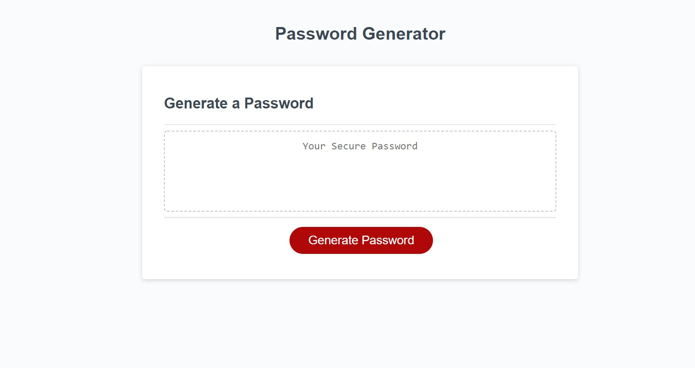

this week i made a random password generator
it selects a custom password for you based on the inputs you provide it and prints to the screen your new password,
it uses an array of characters to chosen at random to produce a password that meets the requested criteria. 

[deployed website](https://jonahlindsley.github.io/randomPassword/)
