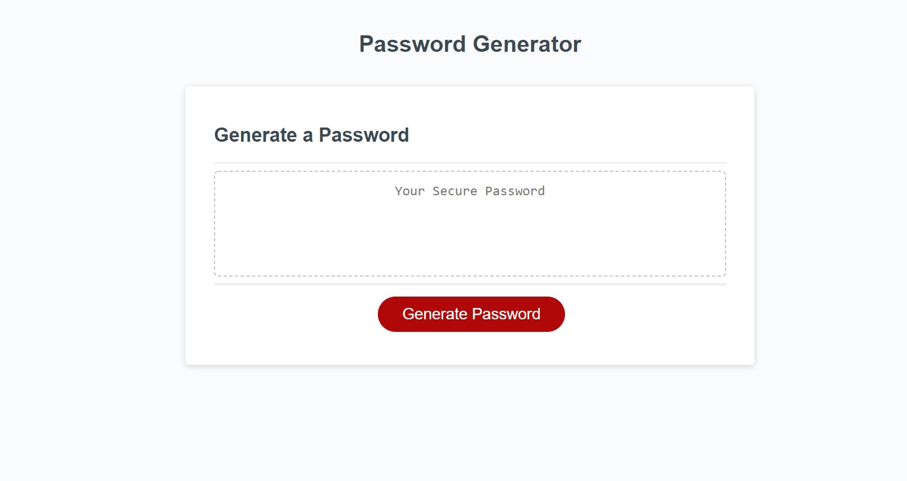

  # Password generator  
  ***
  ## Discription 
  
  this is a simple website that creates a strong random password for you, users can choose how long they want the password to be, if they want numbers, special characters, upper or lower case letters and the site will provide a new randomly generated password that meets the provided constraints.  
  
  ***
  ## table of contents
  * [installation](#installation)
  * [usage](#usage)
  * [contributors](#contributors)
  * [tests](#tests)
  * [questions](#questions)
  ***
  ## the deployed website  
  [click to view deployed website](https://jonahlindsley.github.io/Password-generator/)
  ***
  ## installation
  no need to install  
  ***
  ## usage
  follow the provided link and hit the 'generate password' button  
  ***
  ## tests
  these are the test you should run to ensure optimum proformance: no tests needed  
  ***
  ## contributors 
  Jonah Lindsley  
  ***
  ## questions 
  please reach out to me via email at jonahlindsley@yahoo.com or [github](https://github.com/jonahlindsley) and i will get back to you 
